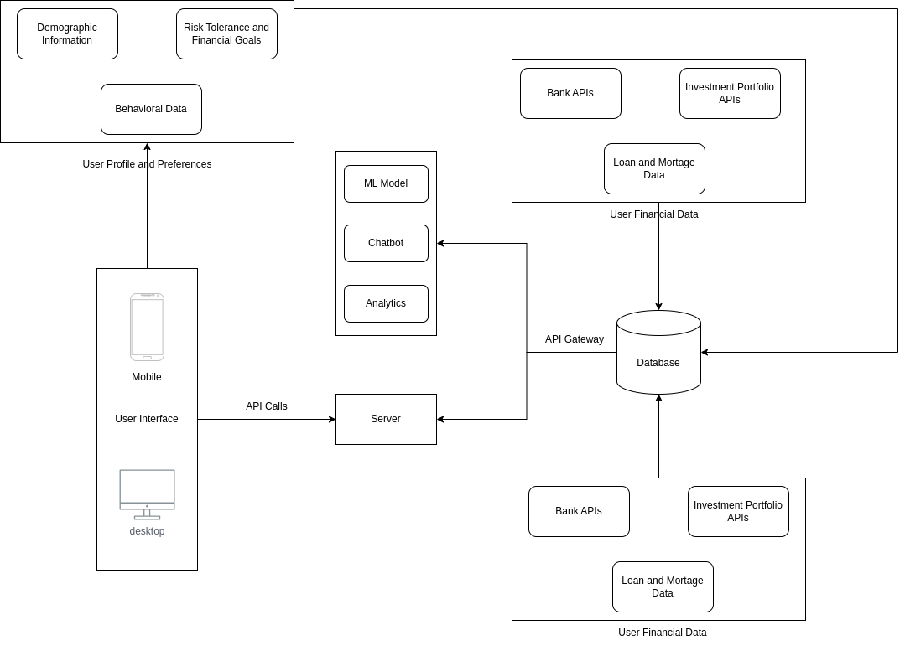

# Stratify Financial Advisor

## Idea

Stratify aims to transform financial advisory services by utilizing AI to deliver personalized, real-time investment strategies. The platform integrates user financial data, transaction history, and market trends to create customized investment recommendations, enabling users to achieve their financial objectives with confidence.

## System Architecture



## Solution

Stratify employs advanced AI models and extensive data analysis to provide tailored investment advice. By continuously monitoring financial transactions and market conditions, the platform dynamically adjusts strategies to optimize returns and manage risks. The user-friendly solution offers explainable AI to make complex financial concepts accessible through intuitive visualizations.

## Approach

1. **Data Collection and Integration**:

- Aggregate user financial data, transaction history, and market trends.
- Store data in a centralized data lake and structured database for efficient access and processing.

2. **AI Model Development**:

- Develop generative AI models using TensorFlow to analyze financial data and generate personalized investment recommendations.
- Implement Natural Language Processing (NLP) to translate financial data into understandable narratives.

3. **Real-Time Analysis**:

- Use Kafka for real-time data ingestion and Azure services for continuous monitoring.
- Employ Redis for caching and managing asynchronous jobs.

4. **Personalized Advisory Services**:

- Generate and adjust investment strategies based on user data and market conditions.
- Use explainable AI to provide clear, visual explanations of recommendations.

5. **User Interaction and Interface**:

- Develop a ReactJS frontend for user interaction.
- Provide a dashboard for linking accounts, setting financial goals, and viewing personalized advice.

## Tech Stack

- **Frontend**: ReactJS
- **Backend**: Python (Django or FastAPI)
- **Database**: PostgreSQL
- **Data Processing**: Azure Data Lake, Azure Stream Analytics
- **Real-Time Data**: Kafka
- **AI/ML**: TensorFlow
- **Caching & Job Queue**: Redis
- **Containerization**: Docker
- **Cloud Platform**: Azure

## Directory Structure

```stratify-financial-advisor/
   ├── data
   │   └── demographic.csv
   ├── src
   │   ├── models
   │   │   ├── recommender.py
   │   │   └── explainAI.py
   │   ├── scripts
   │   │   └── data_generator.py
   │   ├── utils
   │   │   └── data_utils.py
   │   ├── monitoring
   ├── main.py
   ├── requirements.txt
   └── README.md
```

### Detailed Directory Description

- **data/**: Contains sample user financial data in demographic.csv.
- **src/**: Source code for the project.
  - **models/**: Contains AI model code.
    - **recommender.py**: AI models for generating investment recommendations.
    - **explainAI.py**: Module for explainable AI visualizations.
  - **scripts/**: Contains scripts for data generation.
    - **data_generator.py**: Script to generate mock transaction data.
  - **utils/**: Utility functions for data handling.
    - **data_utils.py**: Functions for loading and preprocessing data.
  - **monitoring.py**: Code for continuous monitoring of financial transactions.
- **main.py**: Entry point for the project, orchestrating data loading, preprocessing, model execution, and displaying recommendations.